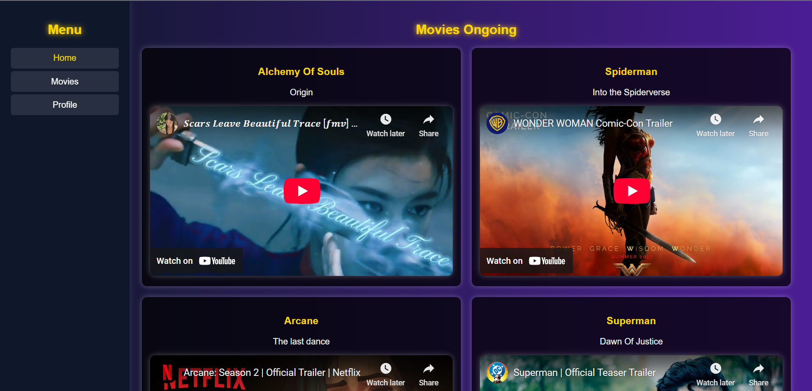
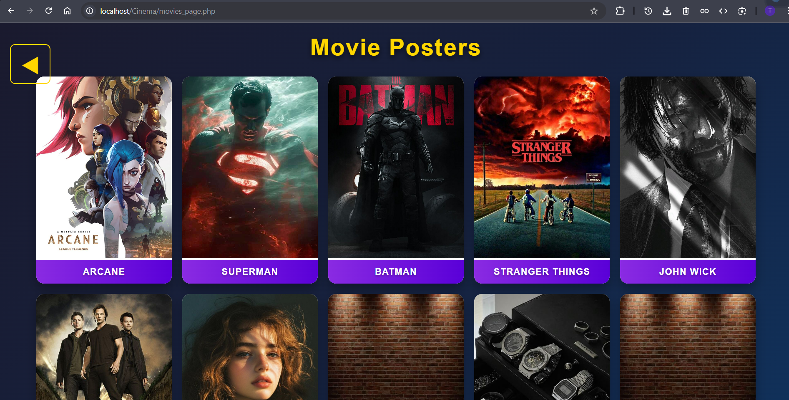

# Cinema Booking System
PHP-based Cinema Booking System with XAMPP database. Supports user authentication, movie bookings, profile setup, and admin management.  

> ⚠️ Note: This is my **first project ever**, so things are not perfect—but it’s a fully functioning, dynamic program, well-suited for beginners who want to learn.

## Features
- User registration and login
- View movie posters
- Book movies and select seats
- Upload profile pictures
- Watch linked YouTube videos
- Admin Panel
- Create and delete movies (Admin)
- Add YouTube trailer URLs (displayed on homepage)
- Booking information for every single movie

---

## Notes for Beginners / Known Limitations
- In **seat creation** (Admin), the CSS is only designed for **5 columns per row**. You can define more rows and columns in the backend, but on the frontend, each row displays as 5 columns. For example, if you define 10 columns in one row, R1 will display as 2 rows.  
- Make sure your project folder includes a folder named `uploads/`. Otherwise, the pictures you upload for movie posters or profile pictures will **not be displayed**.  
- As a student developer, I welcome constructive feedback and questions! 😄  

---

## How to Import Database
1. Open XAMPP and start MySQL.
2. Open phpMyAdmin.
3. Create a new database named `cinema`.
4. Click **Import**, select the `cinema.sql` file, and execute.
5. Your tables are ready to use!

---

## Contact
If you face any difficulty or have questions, feel free to reach out:  
**Email:** thonedra.dev@gmail.com

